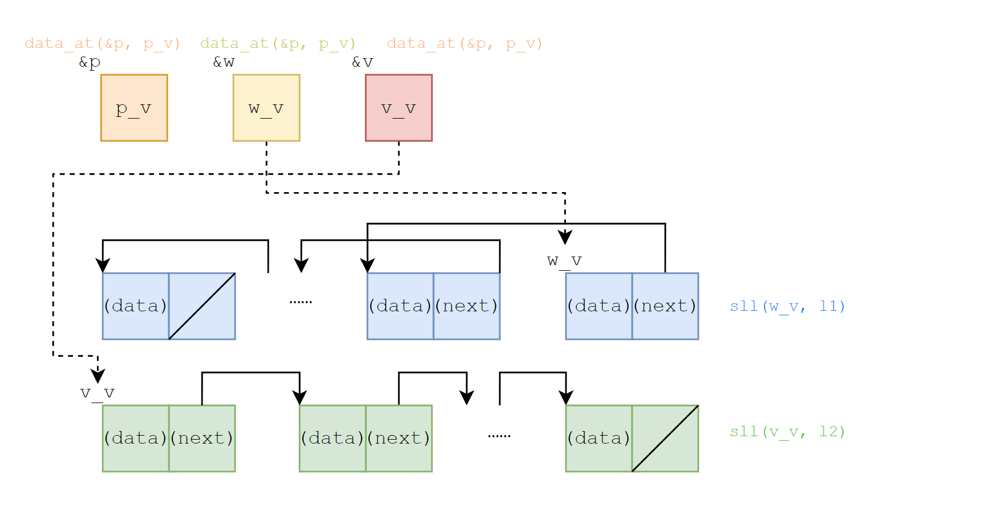
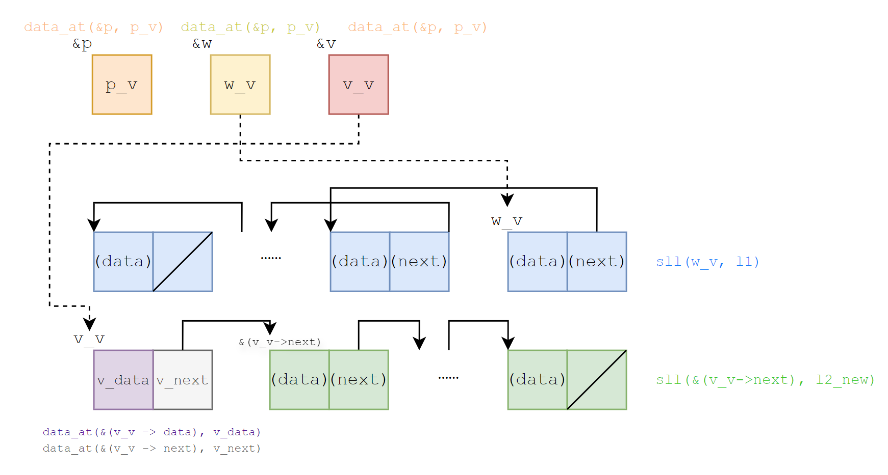

在验证一个C函数时，还需要以标注的形式在语句间写出关键的断言与不变式。语句间的断言是为了辅助函数前后条件的证明而写出的。

# 基础分离逻辑断言语法

## 以单链表取反为例

我们依然以单链表取反为例，展示语句间的断言与不变式的基本分离逻辑断言语法(Basic Separation Logic Assertion Language, BSLAL)。T2中的``reverse``函数可以写出下面这些语句间的断言和循环不变量来完成验证：

```c
#include "verification_stdlib.h"
#include "verification_list.h"
#include "sll_def.h"

struct list *reverse(struct list *p) 
/*@ With (l: list Z)
    Require sll(p, l)
    Ensure sll(__return, rev(l))
*/
{
   struct list *w;
   struct list *v;
   w = (void *)0;
   v = p;
   /*@ Assert Inv
          exists p_v w_v v_v l1 l2,
          l == app(rev(l1), l2) &&
          data_at(&p, p_v) *
          data_at(&w, w_v) *
          data_at(&v, v_v) *
          sll(w_v, l1) *
          sll(v_v, l2)
      */
   while (v) {
      /*@ Assert
            exists p_v w_v v_v v_data v_next l2_new l1 l2,
            l == app(rev(l1), l2) &&
            l2 == cons(v_data, l2_new) &&
            data_at(&p, p_v) *
            data_at(&w, w_v) *
            data_at(&v, v_v) *
            data_at(&(v_v -> data), v_data) *
            data_at(&(v_v -> next), v_next) *
            sll(w_v, l1) *
            sll(v_next, l2_new)
      */
      struct list * t;
      t = v -> next;
      v -> next = w;
      w = v;
      v = t;
   }
   return w;
}

```
我们把在C程序中声明的变量称为“程序变量”，在上面的程序中`w`，`p`等就是程序变量；在标注中用量词引出的变量称为“逻辑变量”，上面的`l1`，`w_v`等就是逻辑变量。程序变量在内存中有对应的地址，地址上存储着该程序变量的值。程序执行到某一时刻所有程序变量的地址以及地址上存储的值构成程序状态。函数的前后条件以及语句间的断言都是对当前位置的程序状态的描述。

最基本的基于分离逻辑的断言标注方法要求我们分别描述“程序状态”和“逻辑变量的数学关系”。我们用`data_at(&x, x_v)`来表示程序变量`x`的地址上存储着逻辑变量`x_v`表示的数值（这里命名为`x_v`，表示的意思是value of x），所有关于内存的信息应当分离地描述并用`*`连接。而关于逻辑变量的数学关系的描述则用`&&`连接。

在使用基本分离逻辑断言语法做标注时，不应当在标注中出现任何对程序变量的内存的读取。例如当我们想要在断言中写出“程序变量`a`与程序变量`b`存储的值相等”时，不应当写`a == b`，而应当写`exists a_v b_v, a_v == b_v && data_at(&a, a_v) * data_at(&b, b_v)`。我们在验证工具中做出这样的规定，是因为我们想让断言具备严格并简明的分离逻辑语义，当我们写类似`a == b`这样的断言的时候其实隐含了对程序变量`a,b`的内存读取，当断言中出现多个这样的表达式时就会出现大量内存的重叠，就难以将其转化为“分离”逻辑的条件了。当然，这样的规定会增加用户书写断言的工作量，我们的验证工具在这方面做了优化，支持“简洁分离逻辑断言语法(CSLAL)”来允许在断言中出现对程序变量内存的读取，这将会在下一节中介绍。

我们通过单链表取反的例子中的两处标注来进一步阐明基础分离逻辑断言语法的书写规则：

第一处标注位于进入while循环之前，并在开头处指明`Assert Inv`表示这是对循环不变量的描述。循环不变量是每次即将进入循环条件判断之前程序状态应当满足的条件。首先用`exists`引入逻辑变量。在对逻辑变量的描述中，`l1`表示已经反转的前一半链表，`l2`表示还未反转的后一半链表，因此把`l1`做逆序和`l2`链接以后应当始终等于初始时的列表，所以写出`l == app(rev(l1), l2)`。在对内存的描述中，`data_at(&w, w_v)`表示程序变量`w`的地址上存储的值是`w_v`；形参`p`也是一个局部变量，也用`data_at(&p, p_v)`描述；表示谓词`sll(w_v, l1)`表示以地址`w_v`为头指针的单链表上存储着数据` l1`，也涉及对内存的描述，其含义已经在Coq中定义，验证工具将会自动将其转化为标注语言，因此也要用`*`连接。关于内存的描述必须写在逻辑变量关系的描述之后。

下图展示了第一处标注中涉及到的对内存的描述， 我们用不同颜色表明分离的内存信息（方形左上角标注了每块内存的地址，箭头由指针变量指向对应的地址）：



第二处标注位于每次while循环体开始执行之前，我们即将访问`v -> next`，为此需要证明我们有`v -> next`的访问权限。因此我们要单独描述`v`相关的内存，这样在后续证明时可以由循环条件`while(v)`推出这一事实。我们在循环不变量中对程序状态的描述的基础上，增加了逻辑变量`l2_new`来表示`l2`除去开头之后的部分，它应当满足`l2 == cons(v_data, l2_new)`。同时，对内存的描述也要增加对地址`v_v`上的存储内容。可以用下图来表示：



## 关于函数体的前后条件

上面例子中`reverse`函数的前后条件事实上也是满足基本分离逻辑断言语法的。但这里的情况需要和语句间的情况做区分。在以上例子中，我们注意到在写语句间断言时形式参数`p`用`exists p_v, data_at(&p, p_v)`描述，但是在前条件中直接出现了`sll(p, l)`。这是因为C语言里在函数体执行过程中形式参数作为局部变量使用，因此在写语句间断言时`p`应当被看作程序变量（有地址，地址上存储着值）；但是从函数调用的角度，调用reverse函数的函数只会传递参数的值而不涉及地址。

基本分离逻辑断言语法要求函数体的前后条件中不能涉及对形式参数的地址的描述。这样规定是合理的，考虑以下C程序的例子：

```c
int plus(int x, int y)
/*@ Require emp
    Ensure __return == x + y
*/
{
    int u;
    u = x + y;
    x = x + 100;
    y = y + 100;
    return u;
}
int main()
{
    int a[10];
    scanf("%d%d", &a[1], &a[2], &a[3]);
    printf("%d", plus(a[1]+a[2], a[3]));
    return 0;
}
```

在`plus`函数的前后条件当中，`x,y`不应当被当作程序变量。一方面，在主程序传入参数时，`a[1]+a[2]`是一个表达式，它的地址是未定义的；另一方面，如果把`x,y`当作程序变量，那么在`plus`函数体执行的过程中形式参数`x,y`作为局部变量的值会发生变化，这样当函数体执行结束时后条件`__return == x+y`就不再满足了。

所以单链表取反的例子中，在写函数体的前后条件时`p`应当只被当作一个值（已经引入的逻辑变量）来看待，所以写出`sll(p, l)`。在进入函数体以后，验证工具会自动把这一条件转换成`exists p_v, data_at(&p, p_v) * sll(p_v, l)`。

# 简洁分离逻辑断言语法

基本分离逻辑断言语法要求我们手动写出所有程序变量的地址上的存储信息，也即为每个程序变量分配一个逻辑变量来表示它的值。这样的写法在实际应用中是不太方便的，为此我们的验证工具支持简洁分离逻辑断言语法(Concise Separation Logic Assertion Language, CSLAL)。

上面的单链表取反的例子中的标注可以简洁表述如下：

```c
struct list *reverse(struct list *p) 
/*@ With (l: list Z)
    Require sll(p, l)
    Ensure sll(__return, rev(l))
*/
{
   struct list *w;
   struct list *v;
   w = (void *)0;
   v = p;
   /*@ Assert Inv
          exists p_v l1 l2,
          l == app(rev(l1), l2) &&
          sll(w, l1) * 
          sll(v, l2) *
          data_at(&p, p_v)
      */
   while (v) {
      /*@ Assert
            exists p_v l2_new l1 l2,
            l == app(rev(l1), l2) &&
            l2 == cons(v -> data, l2_new) &&
            sll(w, l1) *
            sll(v -> next, l2_new) *
            data_at(&p, p_v)
      */
      struct list * t;
      t = v -> next;
      v -> next = w;
      w = v;
      v = t;
   }
   return w;
}
```

在第一个标注中，我们用`sll(v, l2)`代替了`exists v_v, data_at(&v, v_v) * sll(v_v, l2)`；用`sll(w, l1)`代替了`exists w_v data_at(&w, w_v) * sll(w_v, l1)`。

在第二个标注中，我们用`sll(w, l1)`代替了`exists w_v, data_at(&w, w_v) * sll(w_v, l1)`；写出`l2 == cons(v -> data, l2_new)`时，实际上涉及了两次内存的访问：首先读取程序变量`v`的内存得到`v`指向的结构体，在从结构体的`data`指针中读出`v -> data`的值，所以实际上这一断言替换的是`exists v_v v_data, l2 == cons(v_data, l2_new) && data_at(&v, v_v) * data_at(&(v_v -> data), v_data)`。同样地，在`sll(v -> next, l2_new)`中也涉及了对`v`的内存的读取，将其展开为基本分离逻辑断言语法后会再次出现`data_at(&v, v_v)`，验证工具会将它们合并。


